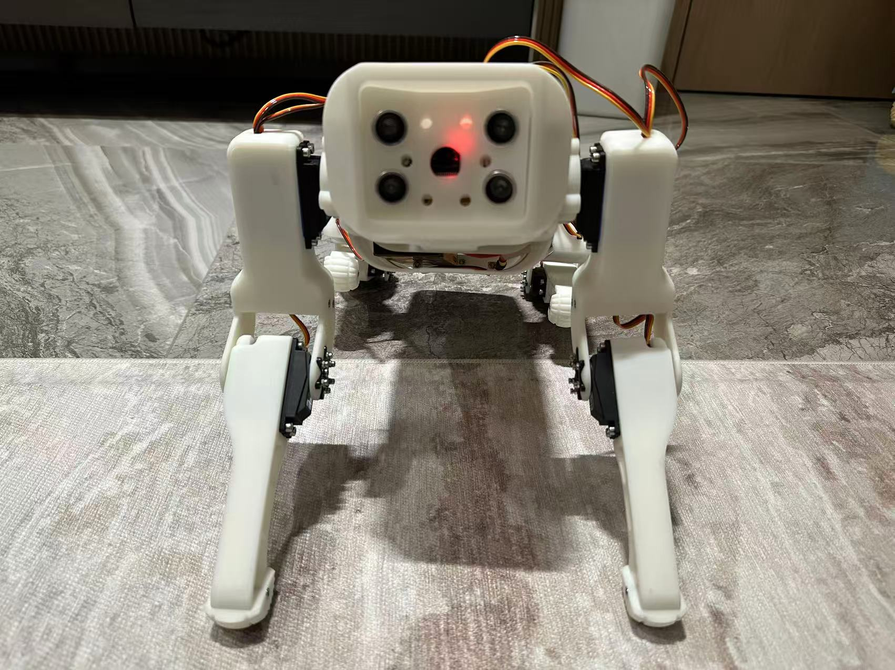
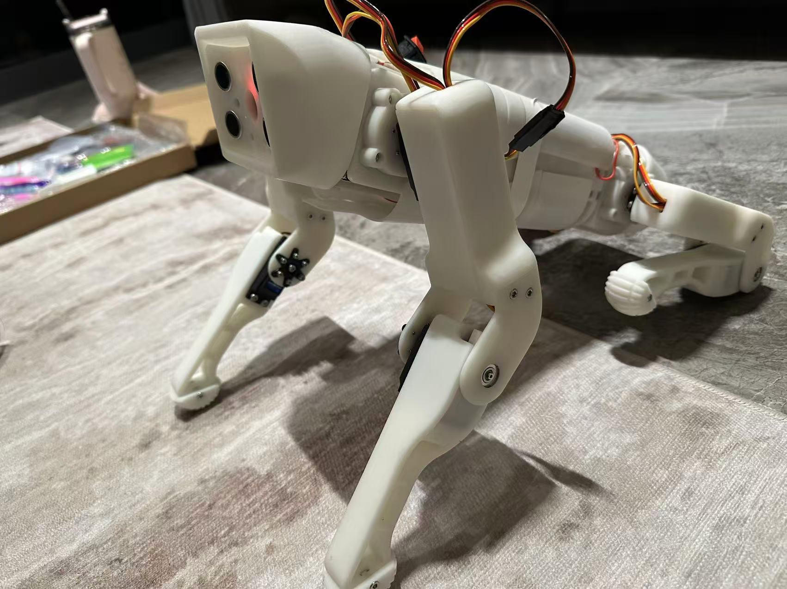
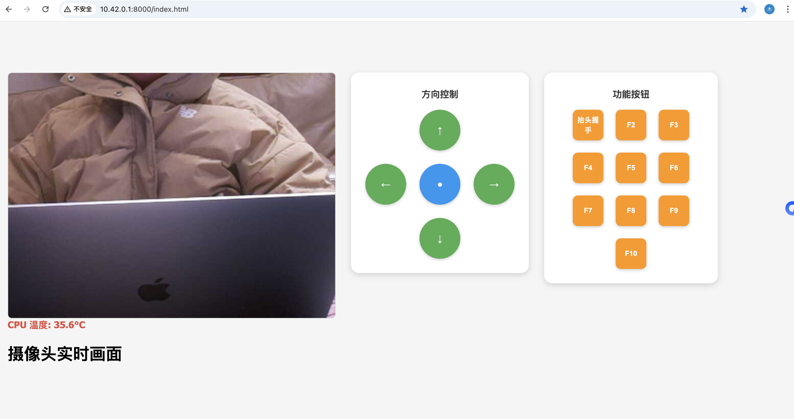

# RLSpotMirco
SpotMirco Dog With Reinforcement Learning

### 3D 模型打印 
《SpotMicroArduino 机器狗打印》
https://www.yuque.com/liujie-ouywh/iyatze/ikwawhyyv9zh3cg9?singleDoc# 

### 模型组装

### 树莓派主程序
rspi5 -> mydog_control.py

### Matlab 步态仿真
《Matlab 步态仿真》
https://www.yuque.com/liujie-ouywh/iyatze/bietzragiusb421l?singleDoc#

